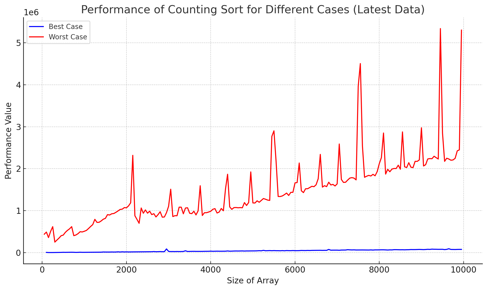

# hla20 Data Structures and Algorithms

## BST and Counting Sort
Implement class for Balanced Binary Search Tree that can insert, find and delete elements.  
Generate 100 random datasets and measure complexity  
Implement Counting Sort algorithm  
Figure out when Counting Sort doesn’t perform.  
### Binary search tree
Implementation is provided under [BalanceBinarySearchTree](src/main/java/org/vkartashov/collections/BalancedBinarySearchTree.java).
Testing is done on 4 different datasets:
1) Sorted data is inserted into tree
2) Reverse sorted data is inserted into tree
3) Sorted data is shuffled and inserted into tree
4) Random data is inserted into tree
#### Search Min Value from range (1% out of N)

#### Search Avg Value (25% out of N)

#### Search Mid Value from range (50% out of N)

#### Search Max Value from range (100% out of N)

#### Search avg value after rebalancing trees (25% out of N)

### Counting Sort
Counting sort performs bad in case if there is a big range of values in array
Data is tested on 2 different datasets:
1) Dataset where range of possible values is less than size of dataset (Best case)
2) Dataset where range of possible values is bigger than size of dataset (Worst case)
####
